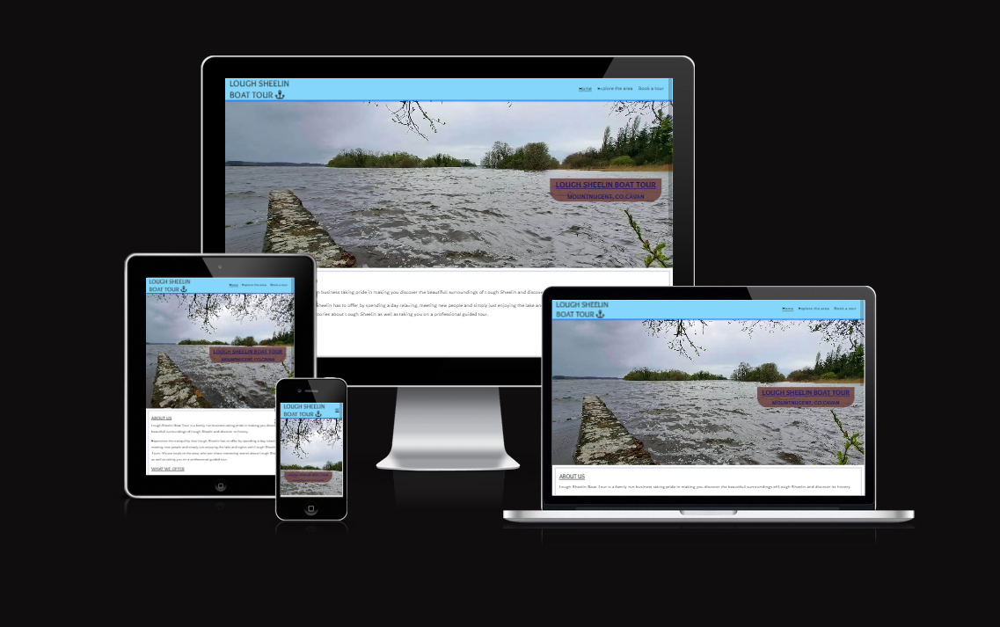

# Lough Sheelin Boat tour

Lough Sheelin Boat tour is a website for a fictional tourism company which main purpose is offering boat tour of Lough Sheelin in county Cavan.

This website also makes you discover the local activities in the surrounding areas.

It was developped as part of the first project of the Diploma in Full Stack Software Development (E-commerce Applications) from Code Institute.

Find the link to the live site here: [Lough Sheelin Boat Tour](https://cabillic.github.io/Lough-Sheelin-Boat-tour/)

# Content

* [User Experience](#ux-user-experience)
* [Design](#design)
* [Features](#features)
* [Technologies Used](#technologies-used)
* [Deployment](#deployment)
* [Testing](#testing)
* [Credits](#credits)

# UX (User Experience)

Lough Sheelin Boat Tour  primary goal is meant to make you discover the lough itself by beeing able to book a tour of the lake, It will also make you discover the local tourist attractions in the surrounding areas.

## User Stories:

### First time user :

- as a first time user, I want to find informations about Lough Sheelin.

- as a first time user, I want to be able to book a tour of the lake in an easy manner.

- as a first time user, I want to know what kind of offer are available.

- as a first time user, I want to view the location via the google map link.

- as a first time user, I want easy access to contact information via the footer.

### Returning user :

- as a returning user, I would like more information about the surrounding areas via the explore the area page.

- as a returning user, I would like to get more information and pictures via the social media links on the footer.

# Design

This website used water related colours, going from lightblue for the shore to darkblue for the deep end of the lake, it has a sober white content with clear borders to make it easy to read.

## Colour scheme: 

I used a French grey with subtles notes of blues for the border colours,
the header represents the Shore of the lake with the pale azure, the box shadow at the bottom of the header is like a wave using brandeis blue.

 As you go down on the page, the footer represent the deep end of the lake with a Federal blue colour.
Light blue was used for the form to be in harmony with the rest of the website.

## Fonts :

I have used 2 ocean-like google font for the website with sans-serif:

- Overlock for the general text

- Spinnaker for all the titles

## imagery :

I have used the forest image from [pexel.com](https://www.pexels.com/),

The Lake map and Loughcrew Cairn pictures were taken from wikimedia,

All other pictures (Lough Sheelin, Mountnugent, and Crover house) were taken by myself.

# Features

The site contain three different pages : 

- Landing page (index)

- Explore the area page

- Book a tour page

## Navbar

The Navigation menu was created following the Love Running project, with a burger icon when cliked on gives a dropdown menu for screens smaller than 992px.
An underline on the menu title in will tell you on which page you are on.

- navbar for laptops

- navbar for mobile phones and tablets

- expanded navbar for mobile phones and tablets

## Hero image

The Hero image remain the same on all screen sizes

## Cover text

The Cover text is made the shape of a boat with a light brown color and a dark blue text for maximum accessibility,
The text font-size and boat are made bigger for screens bigger than 768px

- cover text for screen less than 768px

- cover text for screen more than 768px

## Landing page

The landing page tells you about the family owned business, the offers available and also a quick description and map of the lake, all in a white background for better readability

In small screens, the text will be above the pictures (same for explore page)

## explore page

The explore the area page let you have a quick look at different local tourist attractions, it is the same design as the landing page.
Of the 4 attractions on the page, two of them have the pictures on the left and text on the right, and opposite for the two other one, to break the monotomy of the page

## Book a tour page

This page let you book a tour via the form, as well as gives you a google map link.
I used a lightblue font for the form to break the excessive white background.

## Footer 

The Footer gives you some basic contact informations trough the website (phone and email address) as well as links to social medias.

# Technologies Used

# Deployment
  * The website was deployed on GitHub Pages following these steps:
    
    1 - Login to Github account

    2 - in Settings, click on "pages" in code and automation section on Left menu

    3 - In the Source section, on the dropdown menu, select "deploy from a branch"

    4 - In the branch section, select "Main" on the dropdown menu, and set the folder to "root", then click on Save

    5 - The site is now deployed.

# Testing

# Credits
  * [Freepik.com](https://www.freepik.com) FavIcon taken from Freepik.com design from Mawadee https://www.freepik.com/icon/anchor_1167069

  * [Font awesome](https://fontawesome.com/) Anchor logo taken from Font Awesome

  * [Wikimedia.org](https://commons.wikimedia.org/wiki/File:Lough_Sheelin_map.JPG) Map of Lough Sheelin taken from wikimedia, author: Piotr Miskowicz